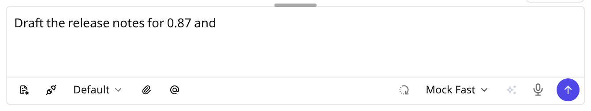
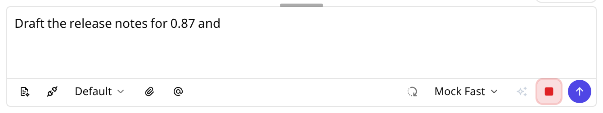
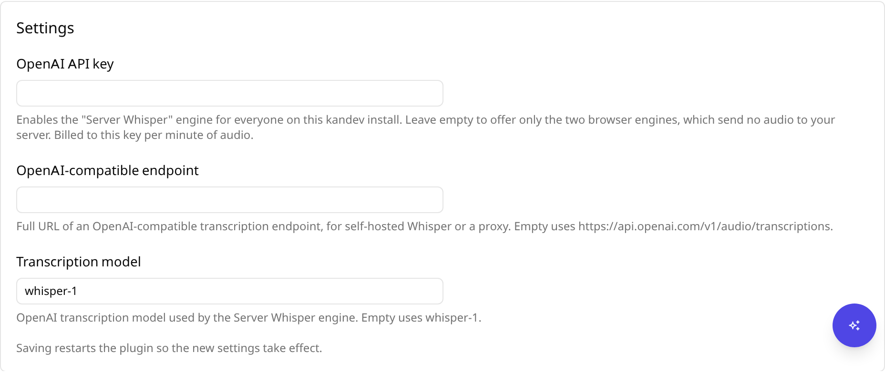
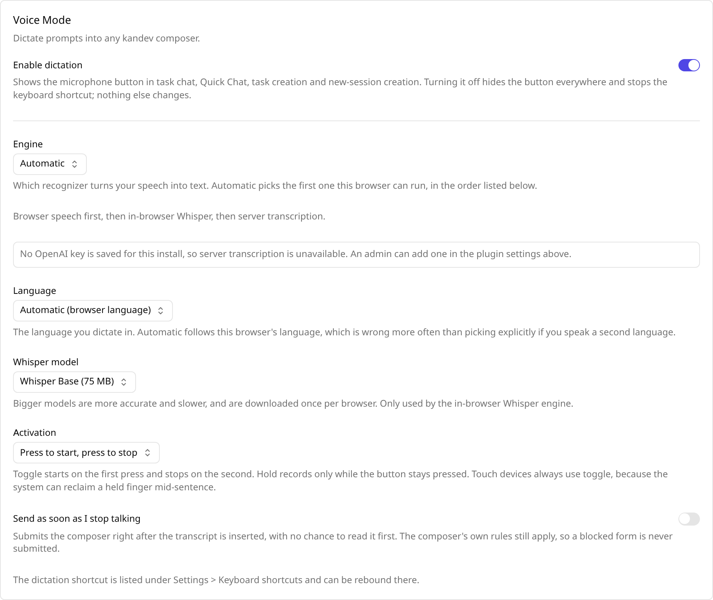
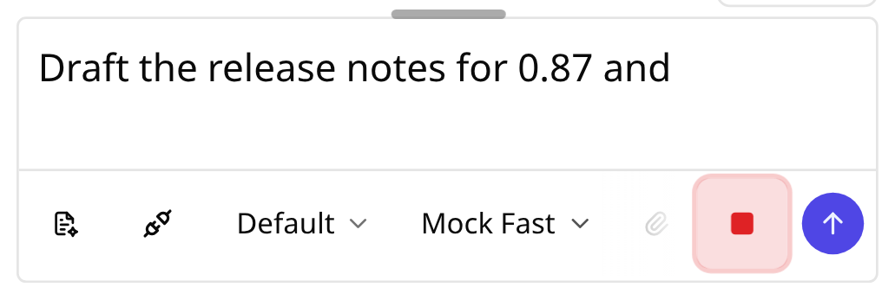

# kandev-plugin-voice

Voice Mode for [kandev](https://github.com/kdlbs/kandev): dictate a prompt into
any native composer instead of typing it.

The microphone button appears beside the existing composer controls in task
chat, Quick Chat, task creation and new-session creation, on desktop and on a
phone. Speak, and the transcript is inserted at your cursor. kandev keeps
ownership of the draft and of submission throughout — the plugin never builds
or sends a message itself.



Press it and it records; press again and the transcript lands at the caret.



This plugin was extracted from kandev core, which shipped Voice Mode until the
composer capability and authenticated-webhook host APIs made a standalone
plugin possible.

## Engines

Three recognizers, picked automatically or chosen per user in
**Settings → Plugins → Voice Mode**:

| Engine               | Where the audio goes                          | Trade-off                                                                                  |
| -------------------- | --------------------------------------------- | ------------------------------------------------------------------------------------------ |
| Browser speech       | The browser vendor's servers                  | Fastest, free, no download. Chromium only.                                                 |
| In-browser Whisper   | Nowhere: it stays on the device               | Fully private. Downloads a 40–240 MB model once, then a few seconds per recording.         |
| Server transcription | Your kandev server, which relays it to OpenAI | Most accurate, works in every browser. Needs an operator API key and is billed per minute. |

`Automatic` picks the first of those the browser can run, in that order. A
pinned engine that turns out to be unusable degrades the same way rather than
leaving a dead button.

## Setup

1. Install the plugin (Settings → Plugins → Install, or the tarball upload
   below). It requires kandev **v0.88.0** or newer. Earlier hosts cannot
   deliver composer results reliably and may not enforce the authenticated,
   size-limited transcription webhook. Keep the leading `v` in the manifest:
   old v0.87.x installers compare raw version strings and fail open when the
   minimum is written as `0.88.0`.
2. Optional: paste an **OpenAI API key** into the plugin's settings form to
   enable the server engine for everyone on the install. Without it, the two
   browser engines still work and no audio ever reaches your server.
3. Each user picks their engine, language, activation style and auto-send under
   Settings → Plugins → Voice Mode. Those preferences are per-user, not shared.

The key is an operator setting, rendered by kandev from the manifest's
`config_schema` and stored in its encrypted vault. It never reaches the browser:
the plugin's Go half relays the audio server-side.



Everything below that is per-user, and every control explains what it changes
and what it costs:



The dictation shortcut defaults to `Cmd/Ctrl+Shift+M` and is rebindable under
Settings → Keyboard shortcuts like any other kandev shortcut. It is one of the
few plugin bindings that fires while a composer has focus (manifest
`allow_in_editor`), because dictating into the field you are typing in is the
entire point.

### On a phone

The action stays beside the composer. On hosts with the Action API it uses the
host's touch target; the legacy fallback follows the host's existing button
geometry. Hold-to-talk becomes press-to-toggle on phones and coarse pointers.
The saved setting stays unchanged, so a docked keyboard restores hold-to-talk.



## Privacy and cost

- **Browser speech** streams audio to the browser vendor. Chromium sends it to
  Google.
- **In-browser Whisper** downloads model weights from the Hugging Face CDN on
  first use and then runs entirely offline. No audio leaves the device.
- **Server transcription** uploads the recording to this plugin's authenticated
  `transcribe` webhook, which relays it to OpenAI with the operator's key and
  returns only the text. The key never reaches the browser, the webhook rejects
  anonymous callers, and an upstream error is never echoed back to the page.
- Nothing is stored. The plugin keeps no recordings, no transcripts and no
  history; its only persisted data is your per-user preferences.

## Repository layout

```text
kandev-plugin-voice/
├── manifest.yaml         # id, capabilities, webhook, keybinding, config schema
├── server/               # Go: the transcribe webhook and the OpenAI relay
└── ui/
    ├── src/              # TypeScript: engines, composer action, settings page
    ├── build.mjs         # esbuild: bundle.js + whisper-worker.js
    └── plugin.css        # plugin-owned styling (see the note below)
```

The UI ships its own CSS rather than using kandev's Tailwind utilities:
Tailwind v4 only compiles classes it finds while scanning kandev's own sources,
so a utility that works today would break the moment kandev deletes its last
use of it.

## Development

Use Node 24, pnpm 10.34.5 and Go 1.26. The Go backend and frontend types use the
Kandev source revision in `.kandev-sdk-ref`. The Go SDK is not yet a separate
module, so `go.mod` resolves it through a sibling checkout:

```text
parent/
├── kandev/                 # github.com/kdlbs/kandev at the pinned revision
└── kandev-plugin-voice/    # this repo
```

If the sibling checkout does not exist, clone Kandev beside this repository.
Then set it to the revision in `.kandev-sdk-ref`:

```bash
git clone https://github.com/kdlbs/kandev.git ../kandev
git -C ../kandev checkout "$(cat .kandev-sdk-ref)"
```

The UI imports frontend SDK types only. The build uses the React instance that
Kandev provides.

```bash
corepack prepare pnpm@10.34.5 --activate
make ui-install
make check-format
make vet
make test
make typecheck
make ui
make verify-package-host
make verify-package
```

`make test` runs the Go tests, UI tests, and package-verifier tests. It also
imports the built UI bundle into a disposable host fixture with fake speech
recognition. `make typecheck` checks the UI types. The package targets check
all five declared platform binaries, the UI bundle, the Whisper worker, the
stylesheet, and the package checksums.

### Real-host browser smoke

The Playwright smoke installs the built archive in a disposable Kandev backend
and checks task chat, Quick Chat, task creation and new-session on desktop and
mobile. It fakes browser speech, microphone and Whisper worker APIs. It needs no
provider credentials or personal audio.

Use the pinned SDK checkout from above. Add one checkout at the released
minimum host, Kandev v0.88.0 commit
`cab9eaf19d997bb4c8020dd263ddc60d5b035b64`, and diagnostic checkouts at
v0.87.0 commit `dafb315f49482c5d57599274e00c7e1f4798da7e` and v0.87.1 commit
`2089e7c92d29b0b8db55c83f584c700397df4de0`:

```bash
git clone https://github.com/kdlbs/kandev.git ../kandev-fallback-088
git -C ../kandev-fallback-088 checkout cab9eaf19d997bb4c8020dd263ddc60d5b035b64
git clone https://github.com/kdlbs/kandev.git ../kandev-min
git -C ../kandev-min checkout dafb315f49482c5d57599274e00c7e1f4798da7e
git clone https://github.com/kdlbs/kandev.git ../kandev-fallback
git -C ../kandev-fallback checkout 2089e7c92d29b0b8db55c83f584c700397df4de0

export VOICE_TMPDIR="$HOME/.cache/kandev-plugin-voice-e2e"
export TMPDIR="$VOICE_TMPDIR"
export PLAYWRIGHT_BROWSERS_PATH="$VOICE_TMPDIR/browsers"
mkdir -p "$VOICE_TMPDIR"

for host in ../kandev ../kandev-fallback-088 ../kandev-min ../kandev-fallback; do
  (cd "$host/apps" && pnpm install --frozen-lockfile)
  (cd "$host/apps/web" && pnpm exec playwright install chromium)
  make -C "$host/apps/backend" build
  (cd "$host/apps/web" && pnpm run build:e2e)
  make -C "$host/apps/backend" e2e-plugin-ui
  make -C "$host/apps/backend" e2e-plugin-package
done

make verify-package-host
VOICE_HOST_VARIANT=modern ui/e2e/run-host-smoke.sh
VOICE_HOST_VARIANT=legacy ui/e2e/run-host-smoke.sh
VOICE_HOST_VARIANT=below-minimum ui/e2e/run-host-smoke.sh
VOICE_HOST_VARIANT=below-minimum-0871 ui/e2e/run-host-smoke.sh
```

The modern run uses the API pin in `.kandev-sdk-ref`; the legacy run verifies
the Button fallback at the declared v0.88.0 minimum. The v0.87.0 and v0.87.1
runs verify that the final archive is rejected before installation. This
rejection depends on the manifest's `v0.88.0` prefix: the old release guards
compare raw strings, while v0.88.0 and newer normalize the host tag before
comparison. `make test-release-version` checks that the release script keeps
this prefix and minimum in both the source manifest and packaged archive.
These runs use real Chromium in desktop and Pixel 5 contexts with fake speech,
microphone and Whisper worker APIs. They require no provider credentials or
personal audio.
Keep `VOICE_TMPDIR` outside `~/.kandev/tasks`; the host rejects repositories
below that path as task worktrees.

## Package and release

Use `make verify-package-host` for a local host archive. Use `make
verify-package` for the full platform archive. Both commands build the UI and
check the exact package contents and checksums.

Install an archive into a **disposable** Kandev instance:

```bash
curl -F package=@kandev-plugin-voice-0.1.0.tar.gz \
  http://localhost:8080/api/plugins/install
```

Kandev rejects a second install with the same plugin ID and version. Uninstall
the plugin before you reinstall that package.

To publish a release, run the `release` workflow from `main`. Select a version
bump and keep `dry_run` false. The workflow checks the UI, Go backend and full
package before it commits release metadata and a version tag.

The workflow also accepts a pushed `vMAJOR.MINOR.PATCH` tag. It checks that the
tag, manifest, Makefile and package versions match before it creates a release.

## Troubleshooting

If the browser cannot access the microphone, open Kandev over HTTPS or use
`http://localhost`. Browsers do not allow microphone access from an insecure
page.

If Server Whisper is unavailable, ask a Kandev operator to set the OpenAI API
key in the plugin's operator settings. The browser engines do not need this key.

## License

MIT. See [LICENSE](LICENSE).
